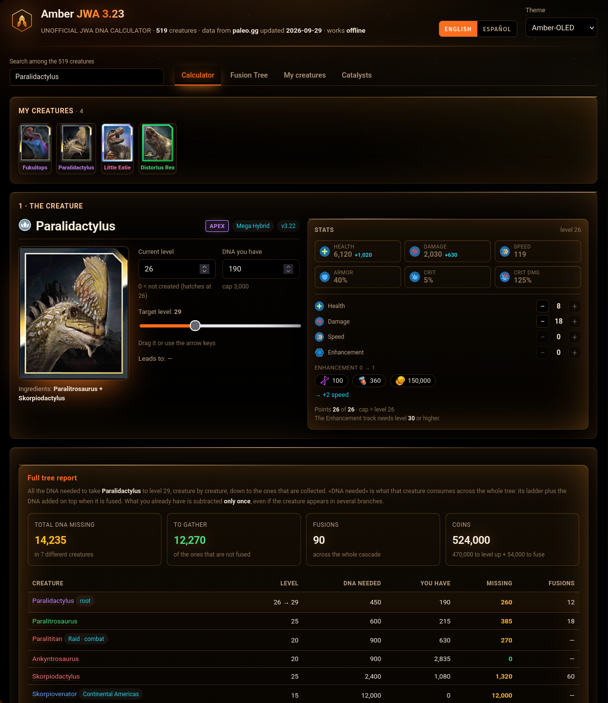

<h1><picture><source media="(prefers-color-scheme: dark)" srcset="img/logo.svg"></picture> <picture><source media="(prefers-color-scheme: dark)" srcset="img/readme/titulo-oscuro.svg"></picture></h1>



**A DNA and cost calculator for Jurassic World Alive 3.23.**

Amber answers one question: how much DNA, how many coins and how many fusions
does it take to bring any creature in the game up to the level you want — and
which ingredients, in cascade, you need in order to fuse the hybrids on the way.

It is a single self-contained HTML file. No server, no CDN, no build step to run
it. Open it and it works offline, with your data stored in your own browser.

Part of what it offers is the way it looks and the language it speaks: it
**works in English and Spanish** — the switch is in the header, English is the
default, and the choice is remembered — and it ships with **seven themes**: five
on the amber base, plus the deep-black default and the original slate-and-green
look it started as. The screenshot above is one of them, *Amber-OLED*.

**Live site:** **[neomikr0n.github.io/amber-jwa-calculator](https://neomikr0n.github.io/amber-jwa-calculator/)**

It is the same `index.html` this repository builds, served as it is. The
creature photos are missing there on purpose — see the note at the end.

---

## 🧮 What it does

- **🧮 Calculator.** Pick any of the 519 creatures, set the level you have and the
  level you want, and it returns the DNA, the coins and the number of fusions
  required, plus what you are missing given the DNA you already hold.
- **🌳 Fusion tree.** The full ingredient cascade for any hybrid, creature by
  creature, down to the ones you simply dart in the wild. Every node is
  editable: type a level and a DNA figure, or untick *Created*, and everything
  hanging from it recalculates. **The tree is always drawn complete**, whatever
  the target level: the branches you already cover are marked *not needed* and
  add nothing to the totals, and pressing any name opens that creature.
- **📸 My creatures.** Everything you enter is saved in the browser, with a target
  level per creature, and exportable as JSON. The photo strip is ordered by
  rarity, rarest first.
- **📊 Real stats.** Health, damage, speed, armour and both critical values at any
  level, with the enhancement track and its cost, and the class badge of the
  creature (fierce, resilient, cunning, wild card) before its name.
- **🧠 Omega training.** Omega creatures earn training points by levelling (7 per
  level) and spend them on any of their six stats, each with its own increment and
  its own cap, as paleo.gg's own table describes. An Omega does not grow with the
  level: its base is the level-26 value and levelling gives it points.
- **🧬 Catalysts.** A recombination planner, marked in the interface as unverified
  data because the rates are not published by the game.
- **🌍 Two languages.** English by default, Spanish behind the switch in the
  header. The interface is authored in English and Spanish lives in a
  dictionary inside the file, so both languages travel in the same HTML.
- **🎨 Seven themes, all on the amber base except the last.** *Default* — deep
  black, OLED-friendly, no attribute. Then **Amber-Crystal** (glass), **Amber-Neon**
  (haloes and grid), **Amber-OLED** (deep blacks under a warm aurora, embers rising
  through it, smoked glass and a sliver of light running along every panel edge),
  **Amber-Liquid** (flowing amber, film grain, gold headings) and **Amber-Cinema**
  (near-black, hairlines, vignette). *Boring* is the original slate-and-green look,
  kept as it was. The choice is saved in `localStorage` and survives a reload, and
  the motion switches off under `prefers-reduced-motion`.

## 🔧 Build it

Only Python 3 is needed, and there are no third-party dependencies — neither to
build it nor to run the fourteen tests. There is one exception and it is in
neither path: `img/readme/generar-titulo.py`, which draws the title artwork at the
top of this file, needs `fontTools` and is only run by hand when that artwork has
to change. The three SVGs it writes are committed, so a clone never needs it.

```bash
python3 build.py
```

That writes `index.html`: one self-contained file you open by double-clicking and
the same file the site serves. It is not edited by hand.

**Its name carries no version on purpose.** A `file://` document gets its
`localStorage` keyed to the full path, so renaming the file does not rename a
file — it creates an empty store and leaves the old one unreachable. The app has
no account and no server: that store *is* your saved creatures. Keeping one
stable name is what keeps them reachable, and it is why `index.html` is not
called `amber-jwa-3.23.html`.

## 📥 Regenerate the data

The creature data is committed, so this is only needed when the game updates.
`--version` is mandatory: it is the one thing an update changes, and it is
written into the data (`meta.version_juego`) so that the whole project reads the
version from a single place. No file name carries it.

```bash
python3 scrape_paleo.py --version 3.24   # rebuilds cache/ and data/jwa.json
python3 build.py                         # rebuilds index.html from it
python3 verificar_version.py             # fails until every mention agrees
python3 descargar_imagenes.py            # optional: fetches the creature photos
```

`scrape_paleo.py` downloads the dinodex and writes `cache/`, which is about
92 MB and is not in the repository: it is a regenerable cache, and it is listed
in `.gitignore`.

`descargar_imagenes.py` fetches the 519 creature images into `img/`. They are
**not** in the repository and are not published on the site, because they are
copyrighted game artwork. See `NOTICE`. Without them the calculator still works:
each image hides itself on error and the layout falls back to names and figures.

## 🎁 The one-file demo

```bash
python3 build.py              # the artefact first: the demo packs THAT file
python3 build_demo.py         # -> amber-demo.html (~1 MB)
```

`build_demo.py` packs the delivered artefact, the creature photos of a saved
file, the interface icons and a seed script into **one HTML**: it opens with a
double click, needs no `img/` folder next to it and no network, and starts with
those creatures already loaded, in Spanish and in Amber-OLED. It is a
**packaging of the artefact**, never a second build of the template, and it
stamps the sha256 of the artefact it packed: `probar_demo.py` recomputes it, so
a demo left behind by an older artefact is caught instead of being shown.

It is **not** in the repository. It carries the creature photos inlined, and
those are copyrighted game artwork that this project does not distribute; the
saved file it seeds lives in `.privado/`, which is not published either. A clone
can build it as soon as it has both.

## ✅ Tests

The calculator is verified against an independent Python model of the same
costs, and against the source pages. Every script is standalone:

```bash
python3 modelo.py             # 40 self-check cases plus level-cap invariants
python3 verificar_motor.py    # the HTML engine against modelo.py, field by field
python3 verificar_arbol.py    # the fusion tree, node by node
python3 verificar_fuentes.py  # ingredient relationships and fusion levels
python3 verificar_recetas.py  # the recipes, against the RENDERED source page
python3 verificar_stats.py    # stats, boosts and the level multiplier table
python3 equivalencia.py       # the engine inside a real browser vs modelo.py
python3 probar_ui.py          # interface behaviour in a real browser
python3 probar_estres.py      # cost and tree edge cases
python3 probar_rareza.py      # rarity colours and contrast
python3 verificar_idioma.py   # dictionary parity, English default, pin precedence
python3 probar_demo.py        # the one-file demo: nothing external, nothing stale
python3 verificar_version.py  # one version, and every place that shows it agrees
python3 probar_version.py     # the one above fails when it should, and the update holds
```

The browser tests need Firefox at `/usr/lib/firefox/firefox` and pin the
interface language to Spanish, which is the language their assertions are
written in.

**Six of the fourteen need material that is not in the repository**, so on a
fresh clone they cannot judge anything: `verificar_fuentes.py`,
`verificar_stats.py` and `verificar_recetas.py` read `cache/` (92 MB, rebuilt with
`scrape_paleo.py`), `probar_demo.py` reads `amber-demo.html` (built from
`.privado/`), and `verificar_version.py` and `probar_version.py` read
`.privado/LEEME.md`, which is never published. Leave those out **and say so**
rather than counting them as passed. Two of them announce that they cannot judge
— `probar_demo.py` and `verificar_recetas.py`; the other four stop with a failure
that on a clone reads like a defect in the code.

`verificar_recetas.py` is the one that closes the last hole in the chain.
Everything else compares the page against `modelo.py`, and both read the same
`data/jwa.json`: if the extraction were wrong, the two would be wrong together.
That script re-reads the ingredients and the children from the **rendered HTML**
of the cached page, while `scrape_paleo.py` reads the JSON payload, so the
extraction is compared against the source through a second door.

## 📚 Where the data comes from

Creature data is extracted from **[paleo.gg](https://paleo.gg)**, which the
application credits on screen. Costs and fusion rules were cross-checked against
the site's own calculator, against the official 3.23 release notes, and against
the `jurassic-journal` database.

The DNA per fusion is an **average of 22**: each fusion returns a random amount,
so the computed number of fusions is an estimate, not a promise.

**One figure is not from the source, and it says so.** An Omega's training table
—where each stat tops out, what one point adds and how many points that takes— is
paleo.gg's own, read from the same JSON that feeds their pages. The **pool of 7
points per level** is not published anywhere: it comes from two figures of a
secondary guide (idgt902: a level 26 Omega has 182 points, one at level 11 has
77), which land exactly on 7, and it is confirmed by the game's own screen (a
level 21 Omega with everything spent shows 147). It is carried as medium-high
confidence in the manual, not as an official number.

## ⚖️ Licence

Source code: **Apache License 2.0** — see `LICENSE`.

Third-party data, trademarks and the artwork that is deliberately not
distributed: see `NOTICE`. In short, the licence covers the code in this
repository and does not extend to the game data, and this is an unofficial fan
project with no connection to the game's owners.

## 📝 Notes

- **The deployed site shows no creature photos.** They are copyrighted game
  artwork and are excluded on purpose. Clone the repository and run
  `descargar_imagenes.py` to see them locally.
- **Advertising is a deliberate later decision, not an oversight.** If ads are
  ever added, the sensible order is to ask the rights holders first; monetising
  a fan tool built on someone else's game changes its legal character, and no
  software licence changes that.

---

## 💛 Thanks

- **Congratulations to [paleo.gg](https://paleo.gg) 🎉.** Their dinodex is the
  backbone of this tool: every creature, every DNA cost, every coin figure and
  every ingredient in Amber comes from their pages, and their own calculator is
  what this one was checked against, field by field. A fan tool is only as good
  as the source behind it, and theirs is excellent — thank you for keeping it
  public.
- **A shout-out to [isiynen](https://github.com/isiynen) 👏**, author of
  **[jurassic-journal](https://github.com/isiynen/jurassic-journal)**, the
  offline companion app for Jurassic World Alive. Their database was one of the
  independent readings the cost model was verified against, and the app is a
  great piece of work in its own right. Thank you for keeping it open.

